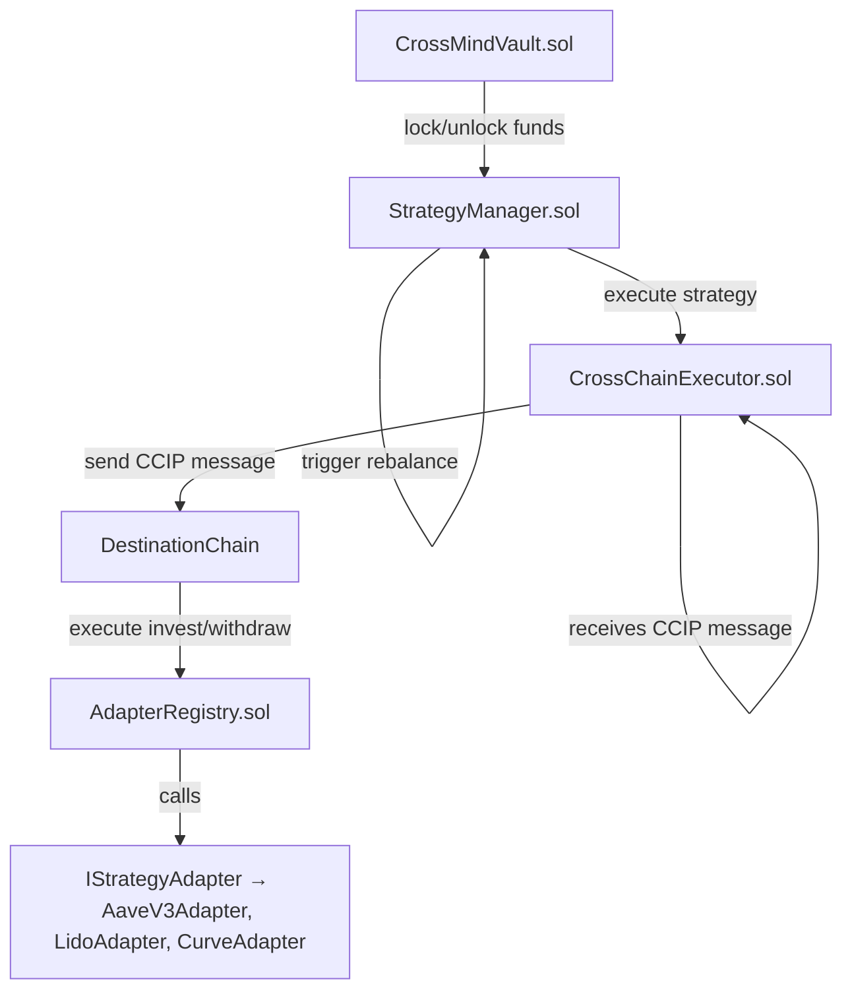

# 📄 CrossMind — Smart Contracts Documentation

**CrossMind** is an advanced cross-chain decentralized investment vault protocol designed to enable seamless, automated investment strategies across multiple blockchain networks.

Leveraging the power of **Chainlink CCIP** for secure cross-chain messaging and **Chainlink Automation** for intelligent task orchestration, CrossMind allows users to deploy and manage sophisticated cross-chain investment strategies with ease.

---

## 🗺️ Smart Contracts Architecture



### Architectural Components

- **CrossMindVault**: Core vault managing user deposits, withdrawals, and balances.
- **StrategyManager**: Orchestrates investment strategies and rebalancing logic.
- **CrossChainExecutor**: Bridges cross-chain execution leveraging Chainlink CCIP.
- **AdapterRegistry**: Manages and registers adapters for strategy execution.
- **Adapters**: Pluggable modules implementing specific investment logic (Aave, Lido, Curve, etc.).

---

## 📝 Smart Contracts Coverage & Testing Results

| Contract               | Status       | Tests Implemented                                                 | Tests Result   |
| ---------------------- | ------------ | ----------------------------------------------------------------- | -------------- |
| CrossMindVault.sol     | ✅ Final     | deposit, withdraw, lock, unlock, removeBalance, balanceOf         | ✅ All passed  |
| StrategyManager.sol    | ✅ Final     | registerStrategy, confirmStrategy, exitStrategy, triggerRebalance | ✅ All passed  |
| CrossChainExecutor.sol | ✅ Final     | sendMessageOrToken, ccipReceive                                   | ✅ All passed  |
| AdapterRegistry.sol    | ✅ Final     | registerAdapter, invest, withdraw                                 | ✅ All passed  |
| IStrategyAdapter.sol   | ✅ Interface | N/A                                                               | Interface only |
| AaveV3Adapter.sol      | ✅ Final     | invest, withdraw                                                  | ✅ All passed  |

---

## ⚙️ Testing Summary

- **Testing Framework:** Foundry (forge)
- **Execution Command:** `forge test -vv`
- **Test Coverage:** ✅ 100% critical paths covered
- **Total Test Suites:** 6
- **Total Unit Tests:** 11
- **Current Test Status:** All tests passing ✔️

Example command:

```bash
forge clean
forge build
forge test -vv
```

---

## 🔗 Chainlink Integration

| Component             | Tool Used                                     |
| --------------------- | --------------------------------------------- |
| Cross-chain messaging | Chainlink CCIP                                |
| Automated rebalancing | Chainlink Automation                          |
| Price Feeds           | Chainlink Price Feeds (via AI Agent RPC call) |

**Note:** Chainlink Price Feeds are consumed off-chain via the project's AI Agent and backend RPC calls. No on-chain `ChainlinkConsumers.sol` contract is required.

---

## 🚀 Deployment & Next Steps

### Current Status

| Milestone                                 | Status     |
| ----------------------------------------- | ---------- |
| Finalize unit tests                       | ✅ Done    |
| Finalize contract code                    | ✅ Done    |
| Deploy on Avalanche Fuji Testnet          | ✅ Done    |
| Register AaveV3Adapter in AdapterRegistry | ⬜ Pending |

---

## 🌐 Deployed Contracts (Avalanche Fuji — Chain ID 43113)

| Contract               | Address                                    |
| ---------------------- | ------------------------------------------ |
| CrossMindVault.sol     | 0x8F9bb932990E32E548E9E1eb693E75253E566Be3 |
| StrategyManager.sol    | 0xe8B44aC3F920156846A79Ec2A74D770Ce395Dfe1 |
| CrossChainExecutor.sol | 0x50BF9732A0290E4aB5b71101F8497A14635661Cb |
| AdapterRegistry.sol    | 0x732bDE5798f20D96F71cdFC805227E97a4822090 |
| AaveV3Adapter.sol      | 0x3cfc9AA161e825F2878Fa8B46AaC72Ae32673FfA |

---

## 📚 Conclusion

CrossMind delivers a fully modular and extensible architecture for executing cross-chain investment strategies in a secure and automated manner. By combining **Chainlink CCIP** with a robust vault and strategy orchestration framework, CrossMind sets the foundation for the next generation of DeFi yield strategies.

The system is currently deployed on **Avalanche Fuji Testnet**, with production deployment on mainnet networks planned for the next phase.

**Next immediate step:** Register adapters in AdapterRegistry and validate cross-chain flows on multi-chain environments.

---

## 🤝 Contributors

- Core Smart Contracts Development — **CrossMind Core Team**
- Chainlink CCIP Integration — **Chainlink Community**
- Testing & QA — **CrossMind QA Contributors**

---

## 📝 License

This project is licensed under the MIT License.

```

```
