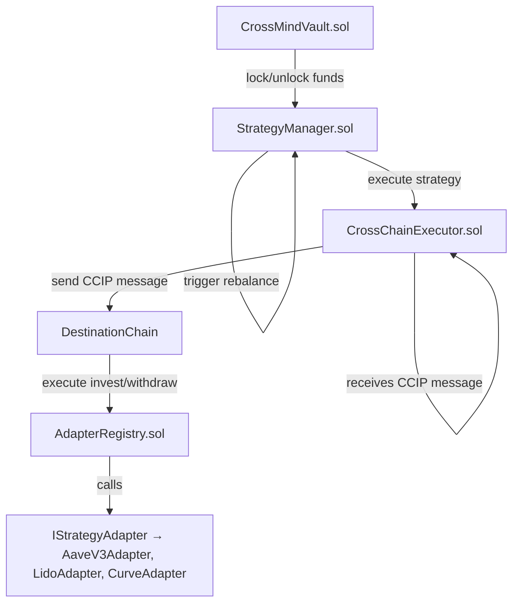

## 📄 CrossMind — Smart Contracts Documentation

CrossMind is a cross-chain decentralized investment vault protocol using Chainlink CCIP and Chainlink Automation to automate cross-chain strategy execution.

This section documents the smart contracts architecture, coverage, and testing results.

---

### 🗺️ Smart Contracts Architecture



---

### 📝 Smart Contracts Coverage & Testing Result

| Contract               | Status       | Tests Implemented                                                 | Tests Result   |
| ---------------------- | ------------ | ----------------------------------------------------------------- | -------------- |
| CrossMindVault.sol     | ✅ Final     | deposit, withdraw, lock, unlock, removeBalance, balanceOf         | ✅ All passed  |
| StrategyManager.sol    | ✅ Final     | registerStrategy, confirmStrategy, exitStrategy, triggerRebalance | ✅ All passed  |
| CrossChainExecutor.sol | ✅ Final     | sendMessageOrToken, ccipReceive                                   | ✅ All passed  |
| AdapterRegistry.sol    | ✅ Final     | registerAdapter, invest, withdraw                                 | ✅ All passed  |
| IStrategyAdapter.sol   | ✅ Interface | N/A                                                               | Interface only |
| AaveV3Adapter.sol      | ✅ Final     | invest, withdraw                                                  | ✅ All passed  |

---

### ⚙️ Testing Summary

- Unit Testing Tool: **Foundry (forge test -vv)**
- Total Test Suites: ✅ 6
- Total Tests: ✅ 11
- All tests passing ✔️

Example command:

```bash
forge clean
forge build
forge test -vv
```

---

### 🔗 Chainlink Integration

| Component             | Tool Used                                     |
| --------------------- | --------------------------------------------- |
| Cross-chain messaging | Chainlink CCIP                                |
| Automated rebalancing | Chainlink Automation                          |
| Price Feeds           | Chainlink Price Feeds (via AI Agent RPC call) |

**Note:** Price Feeds are consumed off-chain via AI Agent / Backend RPC calls — no need for on-chain `ChainlinkConsumers.sol`.

---

### 🚀 Next Steps

- ✅ Finalize unit tests → Done
- ✅ Finalize contract code → Done
- ⬜ Deploy on testnet (Polygon Mumbai / Avalanche Fuji)

---

```markdown
### 🌐 Deployed Contracts

| Contract               | Address (Testnet) |
| ---------------------- | ----------------- |
| CrossMindVault.sol     | ...               |
| StrategyManager.sol    | ...               |
| CrossChainExecutor.sol | ...               |
| AdapterRegistry.sol    | ...               |
| AaveV3Adapter.sol      | ...               |
```

---
