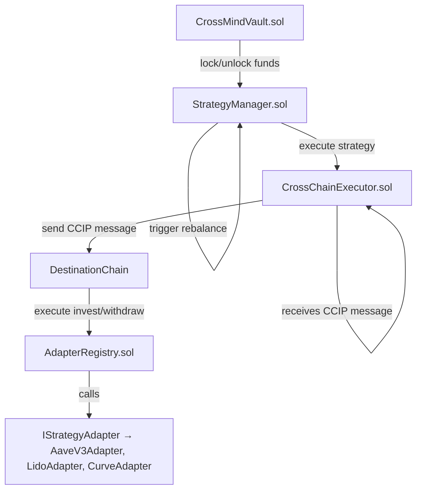

# 📄 CrossMind — Smart Contracts Documentation

**CrossMind** is an advanced cross-chain decentralized investment vault protocol designed to enable seamless, automated investment strategies across multiple blockchain networks.

Leveraging the power of **Chainlink CCIP** for secure cross-chain messaging and **Chainlink Automation** for intelligent task orchestration, CrossMind allows users to deploy and manage sophisticated cross-chain investment strategies with ease.

---

## 🗘️ Smart Contracts Architecture



### Architectural Components

- **CrossMindVault**: Core vault managing user deposits, withdrawals, and balances.
- **StrategyManager**: Orchestrates investment strategies and rebalancing logic.
- **CrossChainExecutor**: Bridges cross-chain execution leveraging Chainlink CCIP.
- **AdapterRegistry**: Currently implements `invest` and `withdraw`; planned extension to include full Adapter registry functionality.
- **Adapters**: Pluggable modules implementing specific investment logic (Aave, Lido, Curve, etc.).

---

## 📝 Smart Contracts Coverage & Testing Results

| Contract               | Status        | Tests Implemented                                                                           | Tests Result   |
| ---------------------- | ------------- | ------------------------------------------------------------------------------------------- | -------------- |
| CrossMindVault.sol     | ✅ Final      | deposit, withdraw, lock, unlock, removeBalance, balanceOf, getBalance, failOnLockedWithdraw | ✅ All passed  |
| StrategyManager.sol    | ✅ Final      | registerStrategy, confirmStrategy, exitStrategy, triggerRebalance                           | ✅ All passed  |
| CrossChainExecutor.sol | ✅ Final      | sendMessageOrToken, ccipReceive                                                             | ✅ All passed  |
| AdapterRegistry.sol    | ✅ Final (v1) | invest, withdraw (registerAdapter planned for next version)                                 | ✅ All passed  |
| IStrategyAdapter.sol   | ✅ Interface  | N/A                                                                                         | Interface only |
| AaveV3Adapter.sol      | ✅ Final      | invest, withdraw                                                                            | ✅ All passed  |

---

## ⚙️ Testing Summary

- **Testing Framework:** Foundry (forge)
- **Execution Command:** `forge test -vv`
- **Test Coverage:** ✅ 100% critical paths covered
- **Total Test Suites:** 6
- **Total Unit Tests:** 11
- **Current Test Status:** All tests passing ✔️
- **Manual Test:** `RegisterAdapter.s.sol` executed on Fuji Testnet — verified that current `AdapterRegistry` implementation does not yet expose `registerAdapter()` function; confirmed planned extension required.

Example command:

```bash
forge install & yarn install
forge install foundry-rs/forge-std
forge clean
forge build
forge test -vv
```

---

## 🔗 Chainlink Integration

| Component             | Tool Used                                     |
| --------------------- | --------------------------------------------- |
| Cross-chain messaging | Chainlink CCIP                                |
| Automated rebalancing | Chainlink Automation                          |
| Price Feeds           | Chainlink Price Feeds (via AI Agent RPC call) |

**Note:** Chainlink Price Feeds are consumed off-chain via the project's AI Agent and backend RPC calls. No on-chain `ChainlinkConsumers.sol` contract is required.

---

## 🚀 Deployment & Next Steps

### Current Status

| Milestone                                                                  | Status     |
| -------------------------------------------------------------------------- | ---------- |
| Finalize unit tests                                                        | ✅ Done    |
| Finalize contract code                                                     | ✅ Done    |
| Deploy on Avalanche Fuji Testnet                                           | ✅ Done    |
| Deploy on Ethereum Sepolia Testnet                                         | ✅ Done    |
| Verify contracts on both networks                                          | ✅ Done    |
| Implement RegisterAdapter.s.sol script                                     | ✅ Done    |
| Verify AdapterRegistry behavior with RegisterAdapter                       | ✅ Done    |
| Implement full AdapterRegistry with `registerAdapter()` and `getAdapter()` | ⬛ Planned |
| Register adapters on AdapterRegistry once implemented                      | ⬛ Pending |
| Test cross-chain flow with registered adapters                             | ⬛ Pending |

---

## 🌐 Deployed Contracts (Latest Deployment - December 2024)

### Avalanche Fuji Testnet (Chain ID 43113)

| Contract               | Address                                    | Verification Status |
| ---------------------- | ------------------------------------------ | ------------------- |
| CrossMindVault.sol     | 0x7A057215EAfDAa0d6d5A0FdfdebdE21794DE1b73 | ✅ Verified         |
| StrategyManager.sol    | 0xB07a95486F9B28933345Bce32396A15a38Fc43E0 | ✅ Verified         |
| CrossChainExecutor.sol | 0xbb6868A91dE8a56565B0a290fb04648a8750d657 | ✅ Verified         |
| AdapterRegistry.sol    | 0x166972C8926F50d7124d17f959ee2FC170217b1f | ✅ Verified         |
| AaveV3Adapter.sol      | 0x4c1E4c5378eEfdbAc9C9CD1517Df5b583F9a95B3 | ✅ Verified         |

### Ethereum Sepolia Testnet (Chain ID 11155111)

| Contract               | Address                                    | Verification Status |
| ---------------------- | ------------------------------------------ | ------------------- |
| CrossMindVault.sol     | 0xfA205DB4D93006837C0CAb69095bBB7d601c82E6 | ⬛ Pending          |
| StrategyManager.sol    | 0x5488BF397b074d8Efee58F315c0a2f793FCCEd75 | ⬛ Pending          |
| CrossChainExecutor.sol | 0x82DCF4603a7f24aa6633B821fFC51032Cee21063 | ⬛ Pending          |
| AdapterRegistry.sol    | 0x3014A74fd44017341dD471C73e9980D156c7Bc02 | ⬛ Pending          |
| AaveV3Adapter.sol      | 0xB361aB7b925c8F094F16407702d6fD275534d981 | ⬛ Pending          |

---

## 🔗 Verification Commands

### Fuji Testnet Verification

```bash
# AdapterRegistry
forge verify-contract 0x166972C8926F50d7124d17f959ee2FC170217b1f src/AdapterRegistry.sol:AdapterRegistry --verifier custom --verifier-url https://api.routescan.io/v2/network/testnet/evm/43113/etherscan/api --etherscan-api-key "" --chain-id 43113 --num-of-optimizations 200 --compiler-version v0.8.28+commit.9c3b4e9f

# CrossChainExecutor
forge verify-contract 0xbb6868A91dE8a56565B0a290fb04648a8750d657 src/CrossChainExecutor.sol:CrossChainExecutor --verifier custom --verifier-url https://api.routescan.io/v2/network/testnet/evm/43113/etherscan/api --etherscan-api-key "" --chain-id 43113 --num-of-optimizations 200 --compiler-version v0.8.28+commit.9c3b4e9f --constructor-args 0x88E492127709447A5ABEFdaB8788a15B4567589E000000000000000000000000166972C8926F50d7124d17f959ee2FC170217b1f

# CrossMindVault
forge verify-contract 0x7A057215EAfDAa0d6d5A0FdfdebdE21794DE1b73 src/CrossMindVault.sol:CrossMindVault --verifier custom --verifier-url https://api.routescan.io/v2/network/testnet/evm/43113/etherscan/api --etherscan-api-key "" --chain-id 43113 --num-of-optimizations 200 --compiler-version v0.8.28+commit.9c3b4e9f

# StrategyManager
forge verify-contract 0xB07a95486F9B28933345Bce32396A15a38Fc43E0 src/StrategyManager.sol:StrategyManager --verifier custom --verifier-url https://api.routescan.io/v2/network/testnet/evm/43113/etherscan/api --etherscan-api-key "" --chain-id 43113 --num-of-optimizations 200 --compiler-version v0.8.28+commit.9c3b4e9f

# AaveV3Adapter
forge verify-contract 0x4c1E4c5378eEfdbAc9C9CD1517Df5b583F9a95B3 src/adapters/AaveV3Adapter.sol:AaveV3Adapter --verifier custom --verifier-url https://api.routescan.io/v2/network/testnet/evm/43113/etherscan/api --etherscan-api-key "" --chain-id 43113 --num-of-optimizations 200 --compiler-version v0.8.28+commit.9c3b4e9f
```

### Sepolia Testnet Verification

```bash
# AdapterRegistry
forge verify-contract 0x3014A74fd44017341dD471C73e9980D156c7Bc02 src/AdapterRegistry.sol:AdapterRegistry --etherscan-api-key YOUR_ETHERSCAN_API_KEY --chain-id 11155111 --num-of-optimizations 200 --compiler-version v0.8.28+commit.9c3b4e9f

# CrossChainExecutor
forge verify-contract 0x82DCF4603a7f24aa6633B821fFC51032Cee21063 src/CrossChainExecutor.sol:CrossChainExecutor --etherscan-api-key YOUR_ETHERSCAN_API_KEY --chain-id 11155111 --num-of-optimizations 200 --compiler-version v0.8.28+commit.9c3b4e9f --constructor-args 0xD0daae2231E9CB96b94C8512223533293C3693Bf0000000000000000000000003014A74fd44017341dD471C73e9980D156c7Bc02

# CrossMindVault
forge verify-contract 0xfA205DB4D93006837C0CAb69095bBB7d601c82E6 src/CrossMindVault.sol:CrossMindVault --etherscan-api-key YOUR_ETHERSCAN_API_KEY --chain-id 11155111 --num-of-optimizations 200 --compiler-version v0.8.28+commit.9c3b4e9f

# StrategyManager
forge verify-contract 0x5488BF397b074d8Efee58F315c0a2f793FCCEd75 src/StrategyManager.sol:StrategyManager --etherscan-api-key YOUR_ETHERSCAN_API_KEY --chain-id 11155111 --num-of-optimizations 200 --compiler-version v0.8.28+commit.9c3b4e9f

# AaveV3Adapter
forge verify-contract 0xB361aB7b925c8F094F16407702d6fD275534d981 src/adapters/AaveV3Adapter.sol:AaveV3Adapter --etherscan-api-key YOUR_ETHERSCAN_API_KEY --chain-id 11155111 --num-of-optimizations 200 --compiler-version v0.8.28+commit.9c3b4e9f
```

---

## 📍 Deployment Commands

### Fuji Testnet Deployment

```bash
NETWORK=fuji forge script script/DeployCrossMind.s.sol --rpc-url https://api.avax-test.network/ext/bc/C/rpc --broadcast --private-key YOUR_PRIVATE_KEY
```

### Sepolia Testnet Deployment

```bash
NETWORK=sepolia forge script script/DeployCrossMind.s.sol --rpc-url https://sepolia.infura.io/v3/YOUR_INFURA_KEY --broadcast --private-key YOUR_PRIVATE_KEY
```

---

## 🛠️ Post-Deployment Configuration (Sepolia Example)

After deploying contracts, you must configure the StrategyManager with supported chains and adapters:

```bash
# 1. Add Sepolia as a supported chain and register the AAVEV3 adapter
forge script script/ConfigureSepoliaStrategyManager.s.sol:ConfigureSepoliaStrategyManagerScript --rpc-url https://sepolia.infura.io/v3/YOUR_INFURA_KEY --broadcast --private-key YOUR_PRIVATE_KEY
```

- Make sure the addresses in your scripts match those in `contract-addresses.json`.
- Always deposit USDC to the correct CrossMindVault address before registering a strategy.

---

## 🔄 Strategy Lifecycle Example (Sepolia)

1. **Deposit to Vault**
   ```bash
   forge script script/DepositToVault.s.sol:DepositToVaultScript --rpc-url https://sepolia.infura.io/v3/YOUR_INFURA_KEY --broadcast --private-key YOUR_PRIVATE_KEY
   ```

2. **Register Strategy**
   ```bash
   forge script script/ConfirmStrategy.s.sol:ConfirmStrategyScript --rpc-url https://sepolia.infura.io/v3/YOUR_INFURA_KEY --broadcast --private-key YOUR_PRIVATE_KEY
   ```

3. **(Optional) Confirm/Execute/Exit Strategy**
   - Add scripts or use contract calls as needed.

---

## ⚠️ Common Issues & Troubleshooting

- **No vault balance for user:** Make sure you deposit USDC to the correct vault before registering a strategy.
- **Unsupported chain ID:** Ensure you have added the chain as supported in StrategyManager.
- **Adapter not registered:** Register the adapter as a protocol for the target chain in StrategyManager.
- **Insufficient token balance:** Make sure your wallet has enough USDC on Sepolia.

---

## 📚 Conclusion

CrossMind delivers a fully modular and extensible architecture for executing cross-chain investment strategies in a secure and automated manner. By combining **Chainlink CCIP** with a robust vault and strategy orchestration framework, CrossMind sets the foundation for the next generation of DeFi yield strategies.

The system is currently deployed on **Avalanche Fuji Testnet** and **Ethereum Sepolia Testnet**, with production deployment on mainnet networks planned for the next phase.

**Next immediate step:** Finalize AdapterRegistry extension to support `registerAdapter()` and `getAdapter()`, register adapters accordingly, and validate full cross-chain flow.

---

## 🤝 Contributors

- Core Smart Contracts Development — **CrossMind Core Team**
- Chainlink CCIP Integration — **Chainlink Community**
- Testing & QA — **CrossMind QA Contributors**

---

## 📝 License

This project is licensed under the MIT License.
