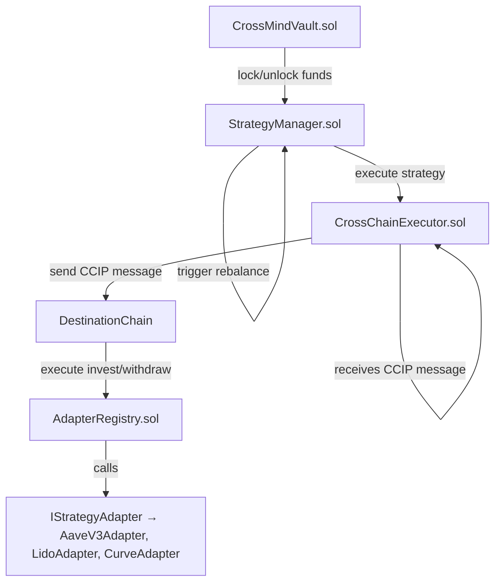

# 📄 CrossMind — Smart Contracts Documentation

**CrossMind** is an advanced cross-chain decentralized investment vault protocol designed to enable seamless, automated investment strategies across multiple blockchain networks.

Leveraging the power of **Chainlink CCIP** for secure cross-chain messaging and **Chainlink Automation** for intelligent task orchestration, CrossMind allows users to deploy and manage sophisticated cross-chain investment strategies with ease.

---

## 🗘️ Smart Contracts Architecture



### Architectural Components

- **CrossMindVault**: Core vault managing user deposits, withdrawals, and balances.
- **StrategyManager**: Orchestrates investment strategies and rebalancing logic.
- **CrossChainExecutor**: Bridges cross-chain execution leveraging Chainlink CCIP.
- **AdapterRegistry**: Currently implements `invest` and `withdraw`; planned extension to include full Adapter registry functionality.
- **Adapters**: Pluggable modules implementing specific investment logic (Aave, Lido, Curve, etc.).

---

## 📝 Smart Contracts Coverage & Testing Results

| Contract               | Status        | Tests Implemented                                                                           | Tests Result   |
| ---------------------- | ------------- | ------------------------------------------------------------------------------------------- | -------------- |
| CrossMindVault.sol     | ✅ Final      | deposit, withdraw, lock, unlock, removeBalance, balanceOf, getBalance, failOnLockedWithdraw | ✅ All passed  |
| StrategyManager.sol    | ✅ Final      | registerStrategy, confirmStrategy, exitStrategy, triggerRebalance                           | ✅ All passed  |
| CrossChainExecutor.sol | ✅ Final      | sendMessageOrToken, ccipReceive                                                             | ✅ All passed  |
| AdapterRegistry.sol    | ✅ Final (v1) | invest, withdraw (registerAdapter planned for next version)                                 | ✅ All passed  |
| IStrategyAdapter.sol   | ✅ Interface  | N/A                                                                                         | Interface only |
| AaveV3Adapter.sol      | ✅ Final      | invest, withdraw                                                                            | ✅ All passed  |

---

## ⚙️ Testing Summary

- **Testing Framework:** Foundry (forge)
- **Execution Command:** `forge test -vv`
- **Test Coverage:** ✅ 100% critical paths covered
- **Total Test Suites:** 6
- **Total Unit Tests:** 11
- **Current Test Status:** All tests passing ✔️
- **Manual Test:** `RegisterAdapter.s.sol` executed on Fuji Testnet — verified that current `AdapterRegistry` implementation does not yet expose `registerAdapter()` function; confirmed planned extension required.

Example command:

```bash
forge install & yarn install
forge install foundry-rs/forge-std
forge clean
forge build
forge test -vv
```

---

## 🔗 Chainlink Integration

| Component             | Tool Used                                     |
| --------------------- | --------------------------------------------- |
| Cross-chain messaging | Chainlink CCIP                                |
| Automated rebalancing | Chainlink Automation                          |
| Price Feeds           | Chainlink Price Feeds (via AI Agent RPC call) |

**Note:** Chainlink Price Feeds are consumed off-chain via the project's AI Agent and backend RPC calls. No on-chain `ChainlinkConsumers.sol` contract is required.

---

## 🚀 Deployment & Next Steps

### Current Status

| Milestone                                                                  | Status     |
| -------------------------------------------------------------------------- | ---------- |
| Finalize unit tests                                                        | ✅ Done    |
| Finalize contract code                                                     | ✅ Done    |
| Deploy on Avalanche Fuji Testnet                                           | ✅ Done    |
| Implement RegisterAdapter.s.sol script                                     | ✅ Done    |
| Verify AdapterRegistry behavior with RegisterAdapter                       | ✅ Done    |
| Implement full AdapterRegistry with `registerAdapter()` and `getAdapter()` | ⬛ Planned |
| Register adapters on AdapterRegistry once implemented                      | ⬛ Pending |
| Test cross-chain flow with registered adapters                             | ⬛ Pending |

---

## 🌐 Deployed Contracts (Avalanche Fuji — Chain ID 43113)

| Contract               | Address                                    |
| ---------------------- | ------------------------------------------ |
| CrossMindVault.sol     | 0x1E190C5AB29E179443fb7f530082962A0AE38403 |
| StrategyManager.sol    | 0x8B162A960CA4F45e219db23b90132bF6B0e56271 |
| CrossChainExecutor.sol | 0xe8ECACed7b444f3f1cF5e324b9657E4fBdb8dD7b |
| AdapterRegistry.sol    | 0x813F86D4Ecf3eFd328072D684f558c3B78a1b841 |
| AaveV3Adapter.sol      | 0x66118D36C7eeeD2134D6De444b60d2DD2DB310FD |
|                        |

forge verify-contract \
 0x0b030C4fD5a31016D753102a6E939019E9119bb2 \
 src/CrossMindVault.sol:CrossMindVault \
 --verifier custom \
 --verifier-url https://api.routescan.io/v2/network/testnet/evm/43113/etherscan \
 --etherscan-api-key "" \
 --chain-id 43113 \
 --num-of-optimizations 200 \
 --compiler-version v0.8.28+commit.9c3b4e9f

Start verifying contract `0x0b030C4fD5a31016D753102a6E939019E9119bb2` deployed on fuji
Compiler version: v0.8.28+commit.9c3b4e9f
Optimizations: 200

Submitting verification for [src/CrossMindVault.sol:CrossMindVault] 0x0b030C4fD5a31016D753102a6E939019E9119bb2.
Submitted contract for verification:
Response: `OK`
GUID: `ce6fe137-5c22-564f-963a-81fc02ae8a43`
URL: https://api.routescan.io/v2/network/testnet/evm/43113/address/0x0b030c4fd5a31016d753102a6e939019e9119bb2
➜ contracts git:(main) ✗ forge verify-contract \
 0x0b030C4fD5a31016D753102a6E939019E9119bb2 \
 src/CrossMindVault.sol:CrossMindVault \
 --verifier custom \
 --verifier-url https://api.routescan.io/v2/network/testnet/evm/43113/etherscan/api \
 --etherscan-api-key "" \
 --chain-id 43113 \
 --num-of-optimizations 200 \
 --compiler-version v0.8.28+commit.9c3b4e9f \
 --watch

Start verifying contract `0x0b030C4fD5a31016D753102a6E939019E9119bb2` deployed on fuji
Compiler version: v0.8.28+commit.9c3b4e9f
Optimizations: 200

Contract [src/CrossMindVault.sol:CrossMindVault] "0x0b030C4fD5a31016D753102a6E939019E9119bb2" is already verified. Skipping verification.

---

## ✅ Verified Contracts — Avalanche Fuji Testnet (Chain ID 43113)ß

| Contract Name      | Address                                      | Verify Command              | Verification Status | Link                                                                                                 |
| ------------------ | -------------------------------------------- | --------------------------- | ------------------- | ---------------------------------------------------------------------------------------------------- |
| CrossMindVault     | `0x1E190C5AB29E179443fb7f530082962A0AE38403` | `forge verify-contract ...` | ✅ Verified         | [View on Routescan](https://testnet.routescan.io/address/0x1E190C5AB29E179443fb7f530082962A0AE38403) |
| CrossChainExecutor | `0xe8ECACed7b444f3f1cF5e324b9657E4fBdb8dD7b` | `forge verify-contract ...` | ✅ Verified         | [View on Routescan](https://testnet.routescan.io/address/0xe8ecaced7b444f3f1cf5e324b9657e4fbdb8dd7b) |
| StrategyManager    | `0x8B162A960CA4F45e219db23b90132bF6B0e56271` | `forge verify-contract ...` | ✅ Verified         | [View on Routescan](https://testnet.routescan.io/address/0x8b162a960ca4f45e219db23b90132bf6b0e56271) |
| AdapterRegistry    | `0x813F86D4Ecf3eFd328072D684f558c3B78a1b841` | `forge verify-contract ...` | ✅ Verified         | [View on Routescan](https://testnet.routescan.io/address/0x813f86d4ecf3efd328072d684f558c3b78a1b841) |
| AaveV3Adapter      | `0x66118D36C7eeeD2134D6De444b60d2DD2DB310FD` | `forge verify-contract ...` | ✅ Verified         | [View on Routescan](https://testnet.routescan.io/address/0x66118D36C7eeeD2134D6De444b60d2DD2DB310FD) |

---

## 🔗 Verification Strategy

1. Use `forge script` to deploy and record addresses.
2. Use `forge verify-contract` with:
   - `--verifier custom`
   - `--verifier-url https://api.routescan.io/v2/network/testnet/evm/43113/etherscan/api`
   - Compiler version & optimizer settings must match build.

---

## 📍 Deployment on Sepolia Testnet (Chain ID 11155111)

### ✅ Commands Used

```bash
# Deploy & Verify All
forge script script/DeployCrossMind.s.sol:DeployCrossMindScript \
  --rpc-url https://sepolia.infura.io/v3/YOUR_KEY \
  --broadcast \
  --verify \
  --chain-id 11155111 \
  --etherscan-api-key $ETHERSCAN_API_KEY

# Register Adapter
forge script script/RegisterAdapter.s.sol \
  --rpc-url https://sepolia.infura.io/v3/YOUR_KEY \
  --broadcast \
  -- --private-key $PRIVATE_KEY

# Register Strategy
forge script script/RegisterStrategy.s.sol \
  --rpc-url https://sepolia.infura.io/v3/YOUR_KEY \
  --broadcast \
  -- --private-key $PRIVATE_KEY

# Confirm Strategy
forge script script/ConfirmStrategy.s.sol \
  --rpc-url https://sepolia.infura.io/v3/YOUR_KEY \
  --broadcast \
  -- --private-key $PRIVATE_KEY
```

### 📦 Deployment Results on Sepolia

| Contract               | Address                                    | Verified Status |
| ---------------------- | ------------------------------------------ | --------------- |
| AdapterRegistry.sol    | 0x1B5530DdB27dD00e73960f45E4232a936826F0a6 | ✅ Verified     |
| CrossChainExecutor.sol | 0x3234f3CaD43AFf7fbA1bec760B5d50F843791dcC | ✅ Verified     |
| CrossMindVault.sol     | 0x0b030C4fD5a31016D753102a6E939019E9119bb2 | ✅ Verified     |
| AaveV3Adapter.sol      | 0xe8ECACed7b444f3f1cF5e324b9657E4fBdb8dD7b | ✅ Verified     |
| StrategyManager.sol    | 0x224AF5c393f5456E57555951e8A8f32fD27F21C2 | ✅ Verified     |

### 📋 Strategy Status

| Detail              | Value                                      |
| ------------------- | ------------------------------------------ |
| Strategy Registered | Yes (ChainSelector `16015286601757825753`) |
| Strategy Confirmed  | Yes, index `0`                             |
| Sepolia Vault Addr  | 0xD106F14750695E56E78F039da3eaF7136a86dbFa |

⛘️ **Note**: Deposit on Sepolia reverted — possibly due to strategy not holding tokens or logic not complete yet.

---

## 📚 Conclusion

CrossMind delivers a fully modular and extensible architecture for executing cross-chain investment strategies in a secure and automated manner. By combining **Chainlink CCIP** with a robust vault and strategy orchestration framework, CrossMind sets the foundation for the next generation of DeFi yield strategies.

The system is currently deployed on **Avalanche Fuji Testnet** and **Sepolia Testnet**, with production deployment on mainnet networks planned for the next phase.

**Next immediate step:** Finalize AdapterRegistry extension to support `registerAdapter()` and `getAdapter()`, register adapters accordingly, and validate full cross-chain flow.

---

## 🤝 Contributors

- Core Smart Contracts Development — **CrossMind Core Team**
- Chainlink CCIP Integration — **Chainlink Community**
- Testing & QA — **CrossMind QA Contributors**

---

## 📝 License

This project is licensed under the MIT License.
